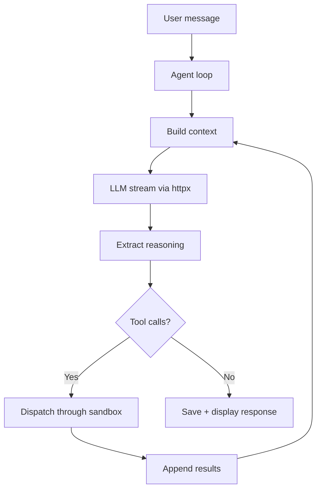

# Stoiquent - Design Specification

<metadata>

- **Version**: 0.4.0
- **Date**: 2026-04-12T22:00:00+09:00
- **Status**: Draft
- **Requirements**: See [requirements.md](requirements.md) for what the system must do

</metadata>

## 1. Architecture

### 1.1 Components

```text
stoiquent/
+-- stoiquent/
|   +-- config.py, models.py, app.py, cli.py
|   +-- agent/       loop.py, context.py, tool_dispatch.py, session.py
|   +-- llm/         provider.py, openai_compat.py, reasoning.py
|   +-- skills/      loader.py, catalog.py, controller.py, executor.py,
|   |                active_store.py, mcp_bridge.py, mcp_app.py,
|   |                mcp_server.py
|   +-- sandbox/     base.py, detect.py, policy.py, oci.py,
|   |                apple_container.py, firecracker.py, gvisor.py,
|   |                bwrap.py, nsjail.py, noop.py
|   +-- persistence/ conversations.py, projects.py
|   +-- ui/          layout.py, chat.py, sidebar.py, file_browser.py,
|   |                project_panel.py, skills_header.py,
|   |                skills_manager.py, tool_card.py
+-- skills/hello-world/SKILL.md
+-- tests/
```

`controller.py` and `active_store.py` (skills) plus `skills_header.py` and
`skills_manager.py` (UI) are the three-surface skills-management pieces
detailed in §4.

### 1.2 Sandbox Backend Tiers

Auto-detected at startup, probed in order of isolation strength:

| Tier | Backend | Category | Platform |
|------|---------|----------|----------|
| 1 | Apple Containers | Full-env | macOS 26+ |
| 2 | Firecracker | Full-env | Linux + KVM |
| 3 | gVisor (`runsc`) | Full-env | Linux |
| 4 | Rootless container (Podman/Finch/Docker) | Full-env | Cross-platform |
| 5 | bubblewrap / nsjail | Process-only | Linux |
| 6 | None (warn) | None | Dev mode |

### 1.3 Data Flow



## 2. Configuration Schema

```toml
[ui]
mode = "native"                    # "native" | "browser"

[llm]
default = "local-qwen"

[llm.providers.local-qwen]
type = "openai"
base_url = "http://localhost:11434/v1"
model = "qwen3:32b"
api_key = ""
supports_reasoning = true
native_tools = true                # false = prompt-based fallback

[skills]
paths = ["~/.agents/skills", "~/.stoiquent/skills"]

[sandbox]
backend = "auto"                   # "auto" | "apple-container" | "firecracker" | "gvisor" | "podman" | "finch" | "docker" | "bwrap" | "nsjail" | "none"
container_runtime = "auto"         # "auto" | "podman" | "finch" | "docker" -- selects OCI runtime when backend is "auto" or Tier 4
tool_timeout = 300.0               # per-tool-call wall-clock (seconds)

[persistence]
data_dir = "~/.stoiquent"
```

## 3. Key Design Rationale

| Decision | Rationale |
|----------|-----------|
| Skills only, no built-in tools | Pure agent runtime; all capabilities portable |
| JSON file persistence | Personal tool; simpler than SQLite to debug/backup |
| MCP deps in SKILL.md metadata | Skills self-declare dependencies; auto-started on activation |
| httpx over openai SDK | Lighter, full SSE control, no framework opinions |
| No LangChain/LlamaIndex | Agent loop ~80 lines; these add massive deps for unneeded functionality |
| Single `openai_compat.py` | All target backends expose OpenAI-compatible API |
| Podman rootless default sandbox | Free, daemonless on Linux, no licensing restrictions |
| Click for CLI | Lightweight, composable subcommands, widely adopted |

## 4. Skills management surfaces

Three coordinated views expose skill activation; all three read from a
single `SkillController` (`stoiquent/skills/controller.py`) that composes
`SkillCatalog`, `MCPBridge`, and `ActiveSkillsStore`. Every mutation
fans out to subscribed surfaces so their rendered state stays
consistent without duplicated in-memory copies.

| Surface | Role | Source |
|---------|------|--------|
| Header quick-toggle (`skills_header.py`) | Chat-adjacent `Skills · N/M ▾` button → per-skill switch dropdown + "Manage skills…" footer. | Modeled on [AnythingLLM's Tools chat-bar toggle](https://docs.anythingllm.com/agent/custom/introduction). |
| Sidebar summary (`sidebar.py:_render_skills_tab`) | Compact `Active (N)` summary with active-skill names + "Manage skills…" button. No switches, no detail. | Preserves requirements §164 sidebar tab without cramming the full catalog into 20% width. |
| Manager overlay (`skills_manager.py`) | Maximized `ui.dialog` with search, source-grouped rows (User/Project/Config), version/tags/MCP-deps badges, View SKILL.md, Reload-from-disk. | Modeled on [Claude.ai's Customize > Skills](https://support.claude.com/en/articles/12512180-use-skills-in-claude) and [AnythingLLM's Settings > Agent Skills](https://docs.anythingllm.com/agent/custom/introduction). |

`SkillController.activate` runs serialized by an `asyncio.Lock`, starts
any MCP servers declared by the skill (rolling back on partial
failure), mutates the catalog, persists the active set via
`ActiveSkillsStore.save_background`, and notifies subscribers.
`deactivate` is symmetric; MCP cleanup failures are reported but not
fatal. Startup restore lives in `app.py` (`_restore_active_skills`
registered on `app.on_startup`), which awaits
`controller.activate_many(store.load())` so restored skills have their
MCP servers running before the first page render.

## 5. References

- See [requirements.md 1.3](requirements.md#13-references) for specification and runtime references
- [Nanobot Agent Loop](https://github.com/HKUDS/nanobot/blob/main/nanobot/agent/loop.py) (reference architecture)
