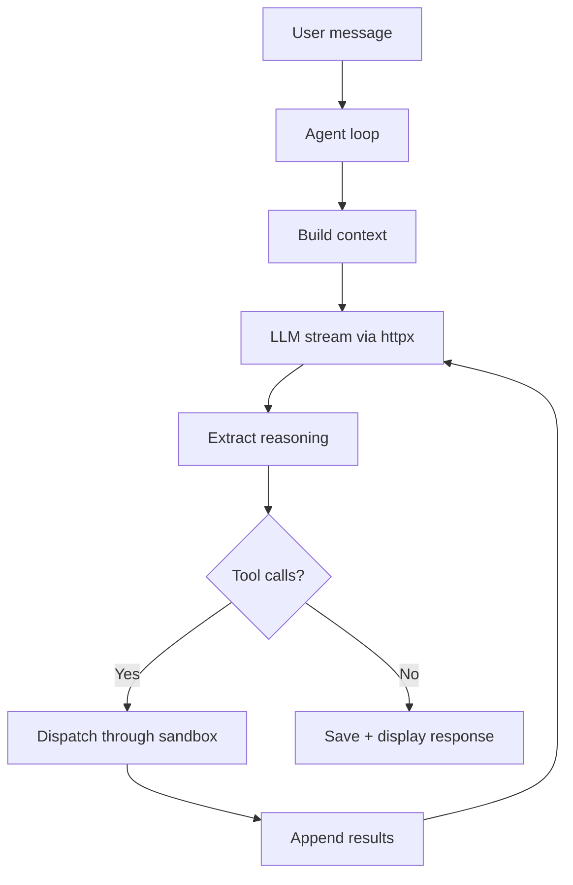

# Stoiquent - Design Specification

<metadata>

- **Version**: 0.1.0
- **Date**: 2026-04-12T21:00:00+09:00
- **Status**: Draft
- **Requirements**: See [requirements.md](requirements.md) for what the system must do

</metadata>

## 1. Architecture

### 1.1 Components

```text
stoiquent/
+-- stoiquent/
|   +-- config.py, models.py, app.py, cli.py
|   +-- agent/       loop.py, context.py, tool_dispatch.py, session.py
|   +-- llm/         provider.py, openai_compat.py, reasoning.py
|   +-- skills/      loader.py, catalog.py, executor.py,
|   |                mcp_bridge.py, mcp_app.py, mcp_server.py
|   +-- sandbox/     base.py, detect.py, policy.py, oci.py,
|   |                apple_container.py, firecracker.py, gvisor.py,
|   |                bwrap.py, nsjail.py, noop.py
|   +-- persistence/ conversations.py, tasks.py
|   +-- ui/          layout.py, chat.py, files.py, tasks.py, skills_panel.py
+-- skills/hello-world/SKILL.md
+-- tests/
```

### 1.2 Data Flow



## 2. Configuration Schema

```toml
[ui]
mode = "native"                    # "native" | "browser"

[llm]
default = "local-qwen"

[llm.providers.local-qwen]
type = "openai"
base_url = "http://localhost:11434/v1"
model = "qwen3:32b"
api_key = ""
supports_reasoning = true
native_tools = true                # false = prompt-based fallback

[skills]
paths = ["~/.agents/skills", "~/.stoiquent/skills"]

[sandbox]
backend = "auto"                   # "auto" | "podman" | "finch" | ... | "none"
container_runtime = "auto"         # "auto" | "podman" | "finch" | "docker"
tool_timeout = 300.0               # per-tool-call wall-clock (seconds)

[persistence]
data_dir = "~/.stoiquent"
```

## 3. Key Design Rationale

| Decision | Rationale |
|----------|-----------|
| Skills only, no built-in tools | Pure agent runtime; all capabilities portable |
| JSON file persistence | Personal tool; simpler than SQLite to debug/backup |
| MCP deps in SKILL.md metadata | Skills self-declare dependencies; auto-started on activation |
| httpx over openai SDK | Lighter, full SSE control, no framework opinions |
| Single `openai_compat.py` | All target backends expose OpenAI-compatible API |
| Podman rootless default sandbox | Free, daemonless on Linux, no licensing restrictions |

## 4. References

- [agentskills.io Specification](https://agentskills.io/specification) | [Client Implementation](https://agentskills.io/client-implementation/adding-skills-support)
- [MCP Apps Overview](https://modelcontextprotocol.io/extensions/apps/overview)
- [NiceGUI Documentation](https://nicegui.io/documentation)
- Sandbox runtimes: [Podman](https://podman.io/) | [Finch](https://github.com/runfinch/finch) | [Apple Containers](https://github.com/apple/container) | [gVisor](https://gvisor.dev/) | [Firecracker](https://firecracker-microvm.github.io/)
- [Nanobot Agent Loop](https://github.com/HKUDS/nanobot/blob/main/nanobot/agent/loop.py) (reference architecture)
