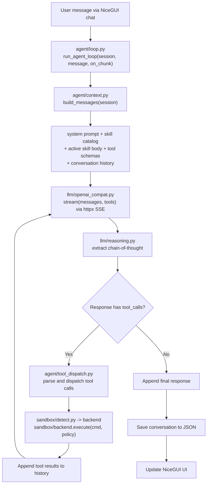

# Stoiquent - Requirements and Specifications

<metadata>

- **Version**: 0.1.0
- **Date**: 2026-04-12T17:03:00+09:00
- **Status**: Draft
- **Stakeholders**: Mike Tian-Jian Jiang (sole developer, personal tool)

</metadata>

## 1. Project Overview

<context>

Stoiquent is a personal desktop application that brings Claude Cowork-style autonomous
task execution to local reasoning LLMs. It provides an agent loop driven entirely by
agentskills.io-compliant SKILL.md files, with no built-in tools.

**Motivation**: Run an autonomous agent locally using open-weight reasoning models
(QwQ, DeepSeek-R1, Phi-4-reasoning, etc.) via Ollama or any OpenAI-compatible endpoint,
keeping data private while maintaining full skill portability.

**Inspiration**:
- [Claude Cowork](https://www.anthropic.com/product/claude-cowork) - UX and autonomous task model
- [Nanobot](https://github.com/HKUDS/nanobot) - Minimal agent loop architecture (~4k lines)
- [agentskills.io](https://agentskills.io/specification) - Skill format standard

</context>

### 1.1 Glossary

- **SKILL.md** - Metadata + instructions file per the [agentskills.io specification](https://agentskills.io/specification)
- **Progressive disclosure** - 3-tier loading strategy: catalog metadata at startup, full instructions on activation, resources on demand
- **MCP** - [Model Context Protocol](https://modelcontextprotocol.io), the standard for tool/resource interchange between agents and tools
- **MCP App** - Interactive UI resource served via `ui://` scheme per [MCP Apps spec](https://modelcontextprotocol.io/extensions/apps/overview)
- **Sandbox backend** - An isolation layer that enforces resource and filesystem policies on tool execution. Two categories: *full-environment* (OCI container or VM -- can install packages) and *process-isolation* (namespace/seccomp filtering -- host env only)
- **OCI container** - A standardized container image format; Stoiquent uses Podman/Finch/Docker to run skill scripts in isolated containers where tools can be installed
- **OpenAI-compatible endpoint** - Any HTTP API implementing the `/v1/chat/completions` contract (Ollama, vLLM, llama.cpp, LM Studio, DeepSeek, etc.)

### 1.2 References

- [agentskills.io Specification](https://agentskills.io/specification)
- [agentskills.io Client Implementation Guide](https://agentskills.io/client-implementation/adding-skills-support)
- [agentskills.io Using Scripts in Skills](https://agentskills.io/skill-creation/using-scripts)
- [MCP Apps Overview](https://modelcontextprotocol.io/extensions/apps/overview)
- [Nanobot Agent Loop](https://github.com/HKUDS/nanobot/blob/main/nanobot/agent/loop.py) (reference architecture)
- [NiceGUI Documentation](https://nicegui.io/documentation)
- [Claude Cowork](https://www.anthropic.com/product/claude-cowork) (UX inspiration)
- [Podman](https://podman.io/) (recommended cross-platform sandbox runtime)
- [Finch](https://github.com/runfinch/finch) (lightweight macOS/Linux container alternative)
- [Apple Containers](https://github.com/apple/container) (macOS 26+ native lightweight VMs)
- [Colima](https://github.com/abiosoft/colima) (lightweight macOS container alternative)
- [gVisor](https://gvisor.dev/) (syscall-intercepting OCI runtime for Linux)
- [Firecracker](https://firecracker-microvm.github.io/) (production multi-tenant microVM sandbox)

## 2. Functional Requirements

### 2.1 Agent Loop

<required>

- [MUST] Implement a minimal perceive-think-act cycle (target ~80 lines of core logic)
- [MUST] Build context from: system prompt + skill catalog + active skill instructions + tool schemas + conversation history
- [MUST] Stream LLM responses to UI callback for real-time display
- [MUST] Execute tool calls returned by the LLM, append results, and loop
- [MUST] Enforce a configurable max iteration limit (default 25) to prevent runaway loops
- [MUST] Distinguish between three timeout layers:
  - Iteration limit (loop count, default 25) -- prevents infinite agent loops
  - Per-tool-call wall-clock timeout (default 300s) -- bounds a single script/MCP call
  - Sandbox resource caps (CPU time default 120s, memory default 512 MB) -- hard enforcement
- [MUST] Support both tool-call responses and plain text responses from the LLM
- [SHOULD] Forward streaming chunks (content, reasoning, tool calls) separately to the UI
- [SHOULD] Support activity-based idle detection as an alternative to hard wall-clock timeout for long-running tools

</required>

### 2.2 LLM Provider

<required>

- [MUST] Support multiple backends via a single OpenAI-compatible HTTP client (httpx)
- [MUST] Support Ollama, vLLM, llama.cpp server, LM Studio, and cloud APIs (DeepSeek, Together, Groq) through a unified interface
- [MUST] Support configuring multiple named providers in `stoiquent.toml`
- [MUST] Extract chain-of-thought from reasoning models via two strategies:
  - API-native: `reasoning_content` field (DeepSeek-style)
  - Tag-based: `<think>...</think>` blocks (Qwen, Phi-style)
- [MUST] Support native tool calling (OpenAI `tools` parameter) for models that support it
- [MUST] Support prompt-based tool calling fallback: inject tool schemas into system prompt, parse JSON output blocks
- [MUST] Support switching between providers at runtime
- [MUST] Support environment variable interpolation in API keys (`${VAR}` syntax)

</required>

<forbidden>

- Do NOT depend on the `openai` Python SDK -- use httpx directly for full control
- Do NOT depend on LangChain, LlamaIndex, or similar heavyweight frameworks
- Do NOT hard-code any model names or endpoints

</forbidden>

### 2.3 Skill System (agentskills.io Compliant)

<required>

- [MUST] Comply fully with the [agentskills.io specification](https://agentskills.io/specification)
- [MUST] Parse SKILL.md files: YAML frontmatter (name, description, license, compatibility, metadata, allowed-tools) + markdown body
- [MUST] Support the full skill directory structure:
  ```text
  skill-name/
  +-- SKILL.md          # Required: metadata + instructions
  +-- scripts/          # Optional: executable code
  +-- references/       # Optional: documentation
  +-- assets/           # Optional: templates, resources, MCP App UIs
  ```
- [MUST] Implement 3-tier progressive disclosure:
  - Tier 1 (Catalog): name + description loaded at startup (~50-100 tokens/skill)
  - Tier 2 (Instructions): full SKILL.md body loaded on activation (<5000 tokens recommended)
  - Tier 3 (Resources): scripts/, references/, assets/ loaded only when referenced
- [MUST] Discover skills from multiple paths:
  - User-level: `~/.agents/skills/`, `~/.stoiquent/skills/`
  - Project-level: `.agents/skills/`, `.stoiquent/skills/` relative to working directory
  - Configurable additional paths via `stoiquent.toml`
- [MUST] Support model-driven activation (LLM reads catalog, decides to activate)
- [MUST] Support user-explicit activation via slash commands (`/skill activate <name>`)
- [MUST] Apply lenient validation: warn on issues, skip only on missing description or unparseable YAML
- [MUST] Handle name collisions: project-level skills override user-level skills
- [SHOULD] Deduplicate activations within a session
- [SHOULD] Protect activated skill content from context compaction

</required>

### 2.4 Skill Script Execution

<required>

- [MUST] Execute scripts from skills' `scripts/` directory as tool calls
- [MUST] Run all scripts through the sandbox system (see section 2.6)
- [MUST] Detect script runner: check shebang line, or fall back to bash
- [MUST] Support Python scripts with PEP 723 inline dependencies via `uv run`
- [MUST] Capture stdout as tool result and stderr for diagnostics
- [MUST] Enforce configurable per-tool-call timeout (default 300s)
- [MUST] Discover tool schemas from scripts via `--help` output parsing or inline metadata
- [SHOULD] Support Python, Bash, and JavaScript/TypeScript scripts

</required>

### 2.5 MCP Integration

#### 2.5.1 MCP Bridge (Client)

<required>

- [MUST] Allow skills to declare MCP server dependencies in SKILL.md metadata
- [MUST] Auto-start declared MCP servers when a skill is activated
- [MUST] Discover tools from connected MCP servers
- [MUST] Forward tool calls to the appropriate MCP server
- [MUST] Use the `mcp` Python SDK for protocol handling
- [MUST] Clean up MCP server connections on skill deactivation and app shutdown

</required>

#### 2.5.2 MCP Apps (UI Resources)

<required>

- [MUST] Support `mcp-app` frontmatter in SKILL.md for defining interactive UIs:
  ```yaml
  mcp-app:
    resource: assets/app.html
    permissions: [clipboard-write]
    csp: [https://cdn.jsdelivr.net]
  ```
- [MUST] Serve skill UIs as `ui://` scheme resources
- [MUST] Serve HTML assets with `text/html;profile=mcp-app` MIME type
- [MUST] Include `_meta.ui.resourceUri` in tool descriptions for MCP App-enabled skills
- [MUST] Implement `postMessage` JSON-RPC bridge for bidirectional UI-agent communication
- [SHOULD] Support multi-file apps with relative path resolution from assets/
- [SHOULD] Render MCP App UIs in an embedded iframe within the NiceGUI chat or as a side panel

</required>

#### 2.5.3 MCP Server Mode

<required>

- [MUST] Expose all active skills as MCP tools via `stoiquent serve`
- [MUST] Allow external MCP clients to connect and invoke skill tools

</required>

### 2.6 Sandboxed Execution

<required>

- [MUST] Route all agent tool execution (script calls, code execution) through a sandbox
- [MUST] Auto-detect the strongest available sandbox backend at startup
- [MUST] Support two sandbox categories:
  - *Full-environment* (OCI container or VM): can install packages, run servers, full Linux userland
  - *Process-isolation* (namespace/seccomp): syscall filtering only, host environment
- [MUST] Support tiered sandbox backends (probed in order of restrictiveness):

  | Tier | Backend | Category | Isolation | Platform |
  |------|---------|----------|-----------|----------|
  | 1 | Apple Containers | Full-env | Lightweight VM + OCI | macOS 26+ |
  | 2 | Firecracker | Full-env | Hardware (KVM) + OCI | Linux |
  | 3 | gVisor (`runsc`) | Full-env | Syscall interception + OCI | Linux |
  | 4 | Rootless container (Podman/Finch/Docker) | Full-env | OCI container | Cross-platform |
  | 5 | bubblewrap (`bwrap`) / nsjail | Process | Namespace + seccomp | Linux |
  | 6 | None (warn) | None | Process only | Dev mode |

- [MUST] Skills that declare tool dependencies (via SKILL.md frontmatter) MUST be executed in a full-environment sandbox (OCI container or VM) capable of package installation
- [MUST] macOS MUST have at least one functional sandbox backend beyond noop (Podman rootless, Finch, Colima, or Apple Containers)
- [MUST] Define a `SandboxBackend` abstract interface:
  - `execute(command, policy, workdir, env, stdin, timeout) -> SandboxResult`
  - `is_available() -> bool`
  - `isolation_level -> IsolationLevel`
- [MUST] Define `SandboxPolicy` with configurable:
  - CPU time limit (default 120s)
  - Memory limit (default 512 MB)
  - Disk limit (default 100 MB)
  - Process count limit (default 64)
  - Network policy: none / egress_only / full (default none)
  - Writable paths (explicit allowlist)
  - Read-only bind mounts
  - Environment type: container / process / none (auto-detected from backend)
- [MUST] Warn at startup if no sandbox backend is available (noop fallback)
- [MUST] Allow backend override in configuration (`sandbox.backend` in stoiquent.toml)
- [SHOULD] Prefer Podman rootless as the cross-platform default container runtime (free, daemonless on Linux, no licensing restrictions)

</required>

<forbidden>

- Do NOT execute skill scripts or tool calls outside the sandbox in production mode
- Do NOT allow sandbox to access filesystem paths beyond explicit bind mounts
- Do NOT default to full network access

</forbidden>

### 2.7 Desktop UI (NiceGUI)

<required>

- [MUST] Build the UI with NiceGUI (Python, FastAPI + Vue/Quasar backend)
- [MUST] Support two launch modes via configuration:
  - Native window: `ui.run(native=True)` using pywebview
  - Browser-based: standard web server opened in default browser
- [MUST] Implement the following layout:
  - **Sidebar (20%)**: session list, tabbed panels (Files / Tasks / Skills)
  - **Main content (80%)**: chat panel with input area
- [MUST] Chat panel features:
  - Role-based message styling (user right-aligned, assistant left-aligned)
  - Per-message collapsible reasoning section (default collapsed)
  - Inline collapsible tool call result cards
  - Streaming token-by-token display
  - Slash command support in input
  - File attachment button
- [MUST] File browser panel: tree view of working directory, click to preview
- [MUST] Task panel: Todo / In Progress / Done columns
- [MUST] Skills panel: list discovered skills with activate/deactivate toggle
- [SHOULD] Render MCP App UIs in embedded iframes
- [SHOULD] Support provider switching via UI dropdown

</required>

### 2.8 Persistence

<required>

- [MUST] Store conversation history as JSON files (one file per session)
- [MUST] Store task lists as JSON
- [MUST] Use XDG-compliant data directory: `~/.local/share/stoiquent/`
  ```text
  ~/.local/share/stoiquent/
  +-- conversations/
  |   +-- 2026-04-12_<uuid>.json
  +-- tasks/
      +-- tasks.json
  ```
- [MUST] Auto-save after each message exchange
- [MUST] Support listing and loading past conversations in the sidebar

</required>

### 2.9 CLI

<required>

- [MUST] Use Click for CLI framework
- [MUST] Support subcommands:
  - `stoiquent run` - launch NiceGUI desktop app
  - `stoiquent serve` - start as MCP server for external clients
  - `stoiquent list-skills` - list all discovered skills
- [MUST] Entry point: `stoiquent` command via `pyproject.toml` `[project.scripts]`

</required>

## 3. Non-Functional Requirements

### 3.1 Performance

<required>

- [MUST] Display first token within 200ms of SSE stream start (no buffering beyond chunk boundaries)
- [MUST] Keep skill catalog injection under 100 tokens per skill
- [SHOULD] Sandbox startup overhead under 500ms for container backends, under 200ms for process-isolation backends
- [SHOULD] Total dependency footprint under 50 MB (no heavyweight ML frameworks)

</required>

### 3.2 Security

<required>

- [MUST] Sandbox all tool execution by default
- [MUST] Never expose API keys in logs or UI
- [MUST] Default sandbox network policy to `none` (no network access)
- [MUST] Support read-only bind mounts for skill directories inside sandbox
- [SHOULD] Gate project-level skill loading on user trust (prevent prompt injection from untrusted repos)

</required>

### 3.3 Portability

<required>

- [MUST] Run on macOS and Linux
- [MUST] Use only Python 3.12+ standard library features (no 3.13+ exclusives)
- [MUST] Skills are portable across any agentskills.io-compliant agent
- [MUST] Provide functional container-based sandbox on both macOS and Linux
- [SHOULD] Auto-detect the strongest available backend per platform

</required>

## 4. Architecture

### 4.1 Project Structure

```text
stoiquent/
+-- pyproject.toml
+-- stoiquent.toml                 # Default config
+-- stoiquent/
|   +-- __init__.py
|   +-- __main__.py                # Entry point (delegates to cli.py)
|   +-- config.py                  # TOML config loader
|   +-- models.py                  # Pydantic models
|   +-- app.py                     # NiceGUI app setup + routing
|   +-- cli.py                     # Click CLI: run, serve, list-skills
|   +-- agent/
|   |   +-- __init__.py
|   |   +-- loop.py                # Core perceive-think-act loop
|   |   +-- context.py             # System prompt + catalog + history assembly
|   |   +-- tool_dispatch.py       # Parse & dispatch tool calls (through sandbox)
|   |   +-- session.py             # Session state container
|   +-- llm/
|   |   +-- __init__.py
|   |   +-- provider.py            # LLMProvider protocol + StreamChunk
|   |   +-- openai_compat.py       # OpenAI-compatible httpx client
|   |   +-- reasoning.py           # Chain-of-thought extraction
|   +-- skills/
|   |   +-- __init__.py
|   |   +-- loader.py              # Skill discovery + SKILL.md parsing
|   |   +-- catalog.py             # Tier 1 catalog
|   |   +-- executor.py            # Script execution (via sandbox)
|   |   +-- mcp_bridge.py          # MCP client for skill-declared MCP servers
|   |   +-- mcp_app.py             # MCP App resource server (ui:// scheme)
|   |   +-- mcp_server.py          # MCP server exposing skills as tools
|   +-- sandbox/
|   |   +-- __init__.py
|   |   +-- base.py                # SandboxBackend ABC + SandboxResult
|   |   +-- detect.py              # Auto-detect available backends (see flowchart)
|   |   +-- oci.py                 # OCI container backend (podman/finch/docker)
|   |   +-- apple_container.py     # Apple Containers backend (macOS 26+)
|   |   +-- firecracker.py         # Firecracker microVM backend (Linux + KVM)
|   |   +-- gvisor.py              # gVisor runsc OCI runtime (Linux)
|   |   +-- bwrap.py               # Bubblewrap process isolation (Linux)
|   |   +-- nsjail.py              # nsjail process isolation (Linux)
|   |   +-- noop.py                # No-op passthrough (dev mode, warns)
|   |   +-- policy.py              # Resource limits, network, filesystem policy
|   +-- persistence/
|   |   +-- __init__.py
|   |   +-- conversations.py       # JSON-per-session conversation storage
|   |   +-- tasks.py               # Task list persistence
|   +-- ui/
|       +-- __init__.py
|       +-- layout.py              # Main layout: sidebar + content splitter
|       +-- chat.py                # Chat panel with streaming + reasoning toggle
|       +-- files.py               # File browser tree view
|       +-- tasks.py               # Task management panel
|       +-- skills_panel.py        # Skill browser + activation UI
+-- skills/                        # Bundled example skills
|   +-- hello-world/
|       +-- SKILL.md
+-- tests/
    +-- test_skill_loader.py
    +-- test_sandbox.py
    +-- test_mcp_app.py
```

### 4.2 Data Models (Pydantic v2)

```python
from pydantic import BaseModel, Field

class SkillMeta(BaseModel):
    name: str                              # kebab-case, max 64 chars
    description: str                       # max 1024 chars
    license: str | None = None
    compatibility: str | None = None
    metadata: dict[str, str] | None = None
    allowed_tools: str | None = None       # space-separated tool names

class MCPAppConfig(BaseModel):
    resource: str                          # e.g. "assets/app.html"
    permissions: list[str] = Field(default_factory=list)
    csp: list[str] = Field(default_factory=list)

class Skill(BaseModel):
    meta: SkillMeta
    instructions: str                      # markdown body
    path: Path                             # absolute path to skill directory
    scripts: list[Path] = Field(default_factory=list)
    mcp_app: MCPAppConfig | None = None    # optional MCP App config
    mcp_config: dict | None = None         # optional MCP server config

class Message(BaseModel):
    role: str                              # system | user | assistant | tool
    content: str
    reasoning: str | None = None
    tool_calls: list[ToolCall] | None = None
    tool_call_id: str | None = None

class ToolCall(BaseModel):
    id: str
    name: str
    arguments: dict

class SandboxPolicy(BaseModel):
    max_cpu_seconds: float = 120.0
    max_memory_mb: int = 512
    max_disk_mb: int = 100
    max_pids: int = 64
    network: Literal["none", "egress_only", "full"] = "none"
    environment: Literal["container", "process", "none"] = "container"
    writable_paths: list[Path] = Field(default_factory=list)
    readonly_bind_mounts: dict[str, str] = Field(default_factory=dict)

class SandboxResult(BaseModel):
    exit_code: int
    stdout: str
    stderr: str
    timed_out: bool = False
    duration_ms: float = 0.0
```

### 4.3 Configuration Schema (`stoiquent.toml`)

```toml
[ui]
mode = "native"           # "native" | "browser"
host = "127.0.0.1"
port = 8080

[llm]
default = "local-qwen"

[llm.providers.local-qwen]
type = "openai"
base_url = "http://localhost:11434/v1"
model = "qwen3:32b"
api_key = ""
max_tokens = 8192
supports_reasoning = true
native_tools = true

[llm.providers.remote-deepseek]
type = "openai"
base_url = "https://api.deepseek.com/v1"
model = "deepseek-reasoner"
api_key = "${DEEPSEEK_API_KEY}"
max_tokens = 16384
supports_reasoning = true

[skills]
paths = ["~/.agents/skills", "~/.stoiquent/skills"]

[sandbox]
backend = "auto"          # "auto" | "podman" | "finch" | "docker" | "apple-container" | "firecracker" | "gvisor" | "bwrap" | "nsjail" | "none"
container_runtime = "auto" # "auto" | "podman" | "finch" | "docker"
tool_timeout = 300.0      # per-tool-call wall-clock timeout (seconds)
max_cpu_seconds = 120     # sandbox CPU time cap (seconds)
default_memory_mb = 512
default_network = "none"  # "none" | "egress_only" | "full"

[persistence]
data_dir = "~/.local/share/stoiquent"
```

### 4.4 Data Flow



### 4.5 Key Design Decisions

| Decision | Choice | Rationale |
|----------|--------|-----------|
| LLM client | httpx directly | Lighter than openai SDK, full SSE control |
| Provider model | Single `openai_compat.py` | Ollama, vLLM, llama.cpp, LM Studio, DeepSeek all expose OpenAI-compatible API |
| Framework deps | None (no LangChain) | Agent loop ~80 lines, tool dispatch ~40 lines |
| Tool source | Skills only (no built-ins) | Pure agent runtime, all capabilities portable |
| Persistence | JSON files | Personal tool, simpler than SQLite to debug/backup |
| MCP config | In SKILL.md metadata | Skills declare MCP deps, auto-started on activation |
| Skill paths | `.stoiquent/skills/` + `.agents/skills/` | Client-specific + cross-client interop |
| Data models | Pydantic v2 | Validation, serialization, schema generation |
| CLI | Click | Subcommands: run, serve, list-skills |
| Sandbox default | Podman rootless (cross-platform) / Apple Containers (macOS 26+) / Firecracker (Linux production) | Auto-detected, strongest available |
| MCP Apps | `ui://` resources from `assets/` | Interactive skill UIs per MCP Apps spec |

## 5. Dependencies

```toml
[project]
name = "stoiquent"
version = "0.1.0"
requires-python = ">=3.12"
dependencies = [
    "nicegui>=2.0",
    "httpx>=0.27",
    "pydantic>=2.0",
    "pyyaml>=6.0",
    "python-frontmatter>=1.1",
    "mcp>=1.0",
    "click>=8.0",
]

[project.optional-dependencies]
dev = ["pytest>=8.0", "pytest-asyncio>=0.23"]

[project.scripts]
stoiquent = "stoiquent.cli:main"
```

## 6. Implementation Phases

### Phase 1: Project Scaffolding + Core Models

- [ ] `pyproject.toml` with dependencies
- [ ] `stoiquent.toml` default config
- [ ] `models.py` - all Pydantic models
- [ ] `config.py` - TOML loader with env var interpolation
- [ ] `cli.py` + `__main__.py` - Click CLI skeleton

### Phase 2: LLM Provider + Agent Loop (Walking Skeleton)

- [ ] `llm/provider.py` - LLMProvider protocol
- [ ] `llm/openai_compat.py` - basic chat with Ollama (non-streaming first)
- [ ] `llm/reasoning.py` - chain-of-thought extraction
- [ ] `agent/session.py` - session state
- [ ] `agent/context.py` - system prompt builder
- [ ] `agent/loop.py` - simple loop (no tools yet)
- [ ] `ui/layout.py` + `ui/chat.py` - basic chat interface
- [ ] `app.py` - NiceGUI app entry point

**Acceptance**: `uv run stoiquent run` launches NiceGUI, type message, get response from Ollama.

### Phase 3: Skills + Sandbox + Tool Execution

- [ ] `skills/loader.py` - discover skills, parse SKILL.md
- [ ] `skills/catalog.py` - Tier 1 catalog
- [ ] `sandbox/base.py` + `sandbox/policy.py` - ABC + policy models
- [ ] `sandbox/detect.py` + `sandbox/noop.py` + `sandbox/oci.py` - detection + OCI container backend
- [ ] `skills/executor.py` - script execution through sandbox
- [ ] `agent/tool_dispatch.py` - parse tool calls, dispatch through sandbox
- [ ] Update `agent/context.py` + `agent/loop.py` - catalog injection, tool loop
- [ ] Update `ui/chat.py` - reasoning toggle, tool call display, streaming
- [ ] Bundled `skills/hello-world/SKILL.md` example

**Acceptance**: Activate skill with script, trigger tool use, see full sandboxed loop.

### Phase 4: MCP Apps + MCP Server

- [ ] `skills/mcp_app.py` - `ui://` resource server for skill UIs
- [ ] `skills/mcp_server.py` - MCP server exposing skills as tools
- [ ] `skills/mcp_bridge.py` - MCP client for skill-declared MCP deps
- [ ] Update UI for MCP App iframe rendering

**Acceptance**: Skill with `assets/app.html` serves via `ui://`, tool includes `_meta.ui.resourceUri`.

### Phase 5: Full UI + Persistence

- [ ] `ui/files.py` - file browser panel
- [ ] `ui/tasks.py` - task management panel
- [ ] `ui/skills_panel.py` - skill browser with activate/deactivate
- [ ] `persistence/conversations.py` + `persistence/tasks.py`
- [ ] Session sidebar with conversation history

**Acceptance**: File browsing, tasks, saved conversations all functional.

### Phase 6: Additional Sandbox Backends + Polish

- [ ] `sandbox/apple_container.py` + `sandbox/firecracker.py` + `sandbox/gvisor.py` + `sandbox/bwrap.py` + `sandbox/nsjail.py`
- [ ] Streaming SSE in `openai_compat.py`
- [ ] Native window mode testing
- [ ] Error handling: LLM timeouts, script failures, sandbox escapes, MCP disconnects
- [ ] Prompt-based tool calling fallback

**Acceptance**: Sandbox escape tests pass (unauthorized writes, memory limits, network blocked).

## 7. Verification Plan

- **Unit tests**: `pytest tests/` - models, skill parsing, sandbox policy, MCP App serving
- **Sandbox integration**: Execute test skill script through each backend, verify isolation (writes outside allowed paths fail, memory limits enforced, network blocked when policy=none)
- **MCP App integration**: Skill with `assets/app.html`, verify `ui://` resource served correctly with `_meta.ui.resourceUri` in tool description
- **End-to-end**: `stoiquent serve --skills-dir ./skills/` starts MCP server, connect with MCP client, invoke skill tool, verify sandbox + UI resource
- **Walking skeleton**: `stoiquent run` launches NiceGUI, chat with Ollama works

## 8. References

See [1.2 References](#12-references) for the complete list.
