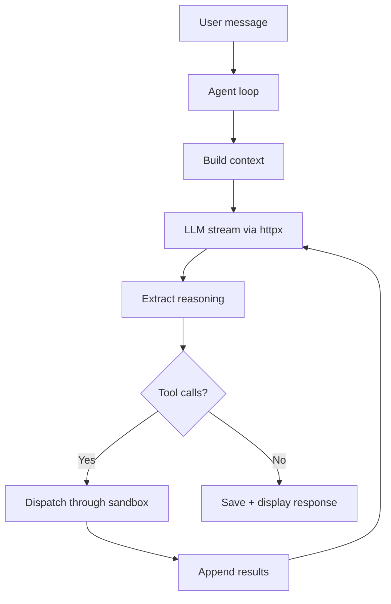

# Stoiquent - Requirements and Specifications

<metadata>

- **Version**: 0.2.0
- **Date**: 2026-04-12T19:30:00+09:00
- **Status**: Draft
- **Stakeholders**: Mike Tian-Jian Jiang (sole developer, personal tool)

</metadata>

## 1. Overview

<context>

Stoiquent is a personal desktop app for autonomous task execution using local reasoning
LLMs (QwQ, DeepSeek-R1, Phi-4-reasoning) via Ollama or any OpenAI-compatible endpoint.
Skills-first: zero built-in tools, all capabilities from
[agentskills.io](https://agentskills.io/specification)-compliant SKILL.md files.

Inspired by [Claude Cowork](https://www.anthropic.com/product/claude-cowork) (UX),
[Nanobot](https://github.com/HKUDS/nanobot) (minimal agent loop), and
[agentskills.io](https://agentskills.io/specification) (skill format).

</context>

### 1.1 Glossary

- **SKILL.md** - Skill metadata + instructions per [agentskills.io spec](https://agentskills.io/specification)
- **Progressive disclosure** - 3-tier loading: catalog at startup, instructions on activation, resources on demand
- **MCP** - [Model Context Protocol](https://modelcontextprotocol.io) for tool/resource interchange
- **MCP App** - Interactive UI via `ui://` scheme per [MCP Apps spec](https://modelcontextprotocol.io/extensions/apps/overview)
- **Sandbox backend** - Isolation layer for tool execution. *Full-environment* (OCI container/VM, can install packages) or *process-isolation* (namespace/seccomp, host env only)
- **OpenAI-compatible endpoint** - HTTP API implementing `/v1/chat/completions` (Ollama, vLLM, llama.cpp, LM Studio, DeepSeek, etc.)

### 1.2 Prerequisites

- Python 3.12+
- [uv](https://docs.astral.sh/uv/) (for PEP 723 script execution and project management)
- An OCI container runtime for sandboxing: [Podman](https://podman.io/), [Finch](https://github.com/runfinch/finch), or Docker

### 1.3 References

- [agentskills.io Specification](https://agentskills.io/specification) | [Client Implementation](https://agentskills.io/client-implementation/adding-skills-support) | [Using Scripts](https://agentskills.io/skill-creation/using-scripts)
- [MCP Apps Overview](https://modelcontextprotocol.io/extensions/apps/overview)
- [NiceGUI Documentation](https://nicegui.io/documentation)
- Sandbox runtimes: [Podman](https://podman.io/) | [Finch](https://github.com/runfinch/finch) | [Apple Containers](https://github.com/apple/container) | [gVisor](https://gvisor.dev/) | [Firecracker](https://firecracker-microvm.github.io/)

## 2. Functional Requirements

### 2.1 Agent Loop

<required>

- [MUST] Implement a minimal perceive-think-act cycle
- [MUST] Build context from: system prompt + skill catalog + active skill instructions + tool schemas + conversation history
- [MUST] Stream LLM responses to UI for real-time display
- [MUST] Execute tool calls from the LLM, append results, and loop
- [MUST] Enforce three timeout layers:
  - Iteration limit (default 25) -- prevents infinite agent loops
  - Per-tool-call wall-clock timeout (default 300s) -- bounds a single script/MCP call
  - Sandbox resource caps (see 2.6) -- hard CPU/memory enforcement
- [MUST] Support both tool-call and plain text responses
- [SHOULD] Support activity-based idle detection as alternative to hard wall-clock timeout

</required>

### 2.2 LLM Provider

<required>

- [MUST] Single OpenAI-compatible HTTP client (httpx) supporting all backends
- [MUST] Configure multiple named providers in `stoiquent.toml`
- [MUST] Extract chain-of-thought via: API-native `reasoning_content` field or `<think>` tag parsing
- [MUST] Support native tool calling (OpenAI `tools` parameter) with prompt-based fallback
- [MUST] Switch providers at runtime
- [MUST] Interpolate env vars in API keys (`${VAR}` syntax)

</required>

<forbidden>

- `openai` Python SDK, LangChain, LlamaIndex, or similar heavyweight frameworks
- Hard-coded model names or endpoints

</forbidden>

### 2.3 Skill System

<required>

- [MUST] Full [agentskills.io specification](https://agentskills.io/specification) compliance
- [MUST] Parse SKILL.md: YAML frontmatter + markdown body
- [MUST] Skill directory structure:
  ```text
  skill-name/
  +-- SKILL.md          # Required
  +-- scripts/          # Optional: executable code
  +-- references/       # Optional: documentation
  +-- assets/           # Optional: templates, MCP App UIs
  ```
- [MUST] 3-tier progressive disclosure:
  - Tier 1 (Catalog): name + description at startup (<100 tokens/skill)
  - Tier 2 (Instructions): full SKILL.md body on activation (<5000 tokens)
  - Tier 3 (Resources): scripts/, references/, assets/ loaded on demand
- [MUST] Discover skills from:
  - User-level: `~/.agents/skills/`, `~/.stoiquent/skills/`
  - Project-level (auto): `.agents/skills/`, `.stoiquent/skills/`
  - Additional paths via `stoiquent.toml`
- [MUST] Model-driven activation (LLM decides) and user-explicit (`/skill activate <name>`)
- [MUST] Lenient validation: warn on issues, skip only on missing description or unparseable YAML
- [MUST] Name collisions: project-level overrides user-level
- [MUST] Execute scripts from `scripts/` as tool calls, through the sandbox (see 2.6)
- [MUST] Detect script runner via shebang; Python with PEP 723 deps via `uv run`
- [MUST] Capture stdout as tool result, stderr for diagnostics
- [MUST] Discover tool schemas via `--help` parsing or inline metadata
- [SHOULD] Deduplicate activations; protect skill content from context compaction

</required>

### 2.4 MCP Integration

<required>

- [MUST] Skills declare MCP server dependencies in SKILL.md metadata; auto-start on activation
- [MUST] Discover and forward tool calls to connected MCP servers via `mcp` Python SDK
- [MUST] Clean up MCP connections on skill deactivation and shutdown
- [MUST] Support `mcp-app` frontmatter for interactive UIs:
  ```yaml
  mcp-app:
    resource: assets/app.html
    permissions: [clipboard-write]
    csp: [https://cdn.jsdelivr.net]
  ```
- [MUST] Serve skill UIs as `ui://` resources with `text/html;profile=mcp-app` MIME type
- [MUST] Include `_meta.ui.resourceUri` in tool descriptions; implement `postMessage` JSON-RPC bridge
- [MUST] `stoiquent serve` exposes active skills as MCP tools for external clients
- [SHOULD] Render MCP App UIs in embedded iframe within chat or side panel

</required>

### 2.5 Sandboxed Execution

<required>

- [MUST] Route all tool execution through a sandbox
- [MUST] Auto-detect strongest available backend at startup:

  | Tier | Backend | Category | Platform |
  |------|---------|----------|----------|
  | 1 | Apple Containers | Full-env | macOS 26+ |
  | 2 | Firecracker | Full-env | Linux + KVM |
  | 3 | gVisor (`runsc`) | Full-env | Linux |
  | 4 | Rootless container (Podman/Finch/Docker) | Full-env | Cross-platform |
  | 5 | bubblewrap / nsjail | Process-only | Linux |
  | 6 | None (warn) | None | Dev mode |

- [MUST] Skills declaring tool dependencies require a full-environment sandbox (Tier 1-4)
- [MUST] macOS must have at least one functional backend beyond noop
- [MUST] `SandboxBackend` ABC: `execute(command, policy, workdir, env, stdin, timeout) -> SandboxResult`
- [MUST] `SandboxPolicy` defaults: CPU 120s, memory 512 MB, disk 100 MB, pids 64, network none
- [MUST] Backend override via `sandbox.backend` in config
- [SHOULD] Prefer Podman rootless as cross-platform default (free, daemonless on Linux)

</required>

<forbidden>

- Executing tool calls outside sandbox in production mode
- Filesystem access beyond explicit bind mounts
- Defaulting to full network access

</forbidden>

### 2.6 Desktop UI (NiceGUI)

<required>

- [MUST] NiceGUI (FastAPI + Vue/Quasar); native window (pywebview) or browser mode via config
- [MUST] Layout: sidebar (20%) with session list + Files/Tasks/Skills tabs; main content (80%) with chat
- [MUST] Chat: role-based styling, per-message collapsible reasoning, inline tool call cards, streaming, slash commands, file attachment
- [MUST] File browser: tree view, click to preview
- [MUST] Task panel: Todo / In Progress / Done
- [MUST] Skills panel: discovered skills with activate/deactivate toggle
- [SHOULD] Provider switching via dropdown

</required>

### 2.7 Persistence

<required>

- [MUST] JSON files: one per conversation session, single task list
- [MUST] Data directory: `~/.local/share/stoiquent/`, configurable via `persistence.data_dir`
- [MUST] Auto-save after each message exchange
- [MUST] List and load past conversations in sidebar

</required>

### 2.8 CLI

<required>

- [MUST] Click CLI with subcommands:
  - `stoiquent run` -- launch NiceGUI desktop app
  - `stoiquent serve [--skills-dir PATH]` -- start as MCP server
  - `stoiquent list-skills` -- list discovered skills
- [MUST] Entry point via `pyproject.toml` `[project.scripts]`

</required>

## 3. Non-Functional Requirements

<required>

- [MUST] Display first token within 200ms of SSE stream start
- [MUST] Skill catalog injection under 100 tokens per skill
- [MUST] Sandbox all tool execution by default; never expose API keys in logs/UI
- [MUST] Default network policy: none; support read-only bind mounts for skill directories
- [MUST] Run on macOS and Linux; Python 3.12 minimum (no 3.13+-only features)
- [MUST] Skills portable across any agentskills.io-compliant agent
- [MUST] Functional container-based sandbox on both macOS and Linux
- [SHOULD] Sandbox startup under 500ms (container) / 200ms (process-isolation)
- [SHOULD] Total dependency footprint under 50 MB
- [SHOULD] Gate project-level skill loading on user trust

</required>

## 4. Architecture

### 4.1 Components

```text
stoiquent/
+-- stoiquent/
|   +-- config.py, models.py, app.py, cli.py
|   +-- agent/       loop.py, context.py, tool_dispatch.py, session.py
|   +-- llm/         provider.py, openai_compat.py, reasoning.py
|   +-- skills/      loader.py, catalog.py, executor.py,
|   |                mcp_bridge.py, mcp_app.py, mcp_server.py
|   +-- sandbox/     base.py, detect.py, policy.py, oci.py,
|   |                apple_container.py, firecracker.py, gvisor.py,
|   |                bwrap.py, nsjail.py, noop.py
|   +-- persistence/ conversations.py, tasks.py
|   +-- ui/          layout.py, chat.py, files.py, tasks.py, skills_panel.py
+-- skills/hello-world/SKILL.md
+-- tests/
```

### 4.2 Configuration (`stoiquent.toml`)

```toml
[ui]
mode = "native"                    # "native" | "browser"

[llm]
default = "local-qwen"

[llm.providers.local-qwen]
type = "openai"
base_url = "http://localhost:11434/v1"
model = "qwen3:32b"
api_key = ""
supports_reasoning = true
native_tools = true                # false = prompt-based fallback

[skills]
paths = ["~/.agents/skills", "~/.stoiquent/skills"]

[sandbox]
backend = "auto"                   # "auto" | "podman" | "finch" | ... | "none"
container_runtime = "auto"         # "auto" | "podman" | "finch" | "docker"
tool_timeout = 300.0               # per-tool-call wall-clock (seconds)

[persistence]
data_dir = "~/.local/share/stoiquent"
```

### 4.3 Data Flow



### 4.4 Key Rationale

| Decision | Rationale |
|----------|-----------|
| Skills only, no built-in tools | Pure agent runtime; all capabilities portable |
| JSON file persistence | Personal tool; simpler than SQLite to debug/backup |
| MCP deps in SKILL.md metadata | Skills self-declare dependencies; auto-started on activation |

## 5. Acceptance Criteria

- **Walking skeleton**: `uv run stoiquent run` launches NiceGUI; chat round-trip with Ollama works
- **Skills + sandbox**: Activate skill with script, trigger tool use, verify sandboxed execution
- **MCP Apps**: Skill with `assets/app.html` serves via `ui://` with `_meta.ui.resourceUri`
- **Full UI**: File browsing, task management, saved conversations, skill activation panel
- **Sandbox isolation**: Writes outside allowed paths fail; memory limits enforced; network blocked when policy=none
